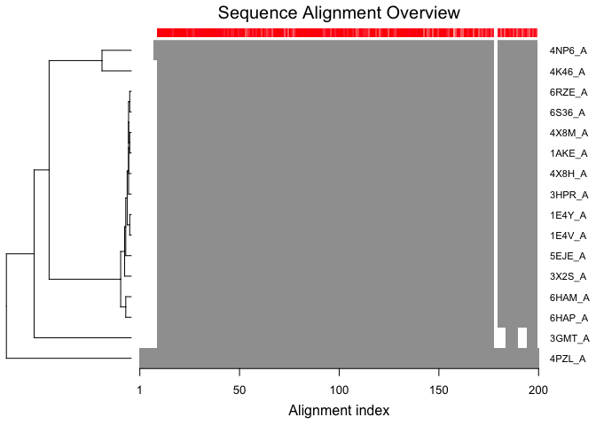
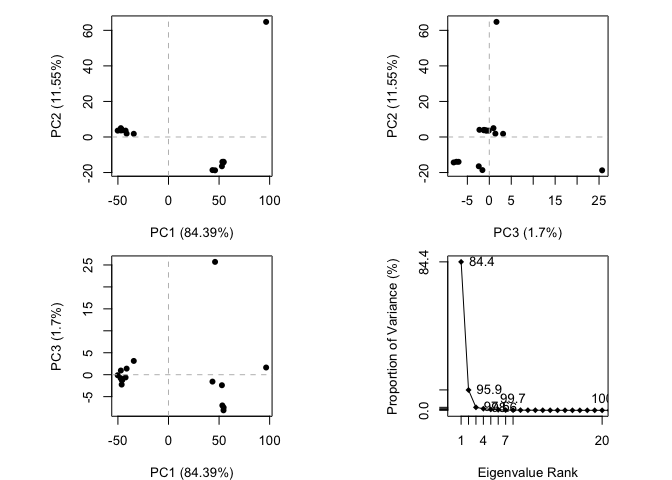
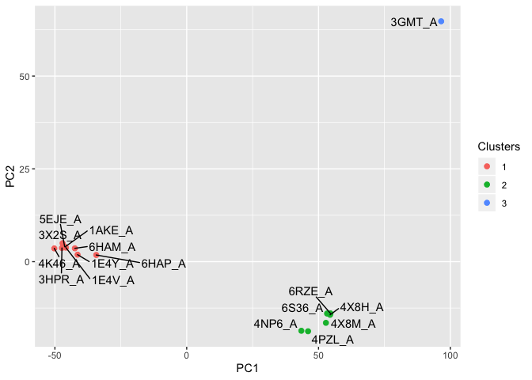
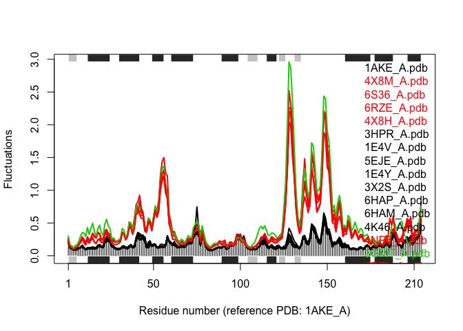

Structural Bioinformatics
================

PDB Statistics
--------------

> Q. What percentage of structures in the PDB are solved by X-Ray and Electron Microscopy.

``` r
stats <- read.csv("./Data Export Summary.csv", row.names=1)
stats
```

    ##                     Proteins Nucleic.Acids Protein.NA.Complex Other  Total
    ## X-Ray                 133756          2086               6884     8 142734
    ## NMR                    11308          1317                265     8  12898
    ## Electron Microscopy     3241            35               1095     0   4371
    ## Other                    284             4                  6    13    307
    ## Multi Method             146             5                  2     1    154

> Q: What proportion of structures in the PDB are protein?

``` r
# Method 1 

Proteins <- sum(stats$Proteins)
all <- sum(stats$Total)
percent <- Proteins/all * 100
percent
```

    ## [1] 92.69057

``` r
# Method 2 

ans <- round(stats$Total / sum(stats$Total) * 100, 2)
names(ans) <- rownames(stats)
ans
```

    ##               X-Ray                 NMR Electron Microscopy               Other 
    ##               88.95                8.04                2.72                0.19 
    ##        Multi Method 
    ##                0.10

> Q: Type HIV in the PDB website search box on the home page and determine how many HIV-1 protease structures are in the current PDB?

Use Bio3D package to read PDB
-----------------------------

``` r
library("bio3d")
library(ggplot2)

pdb <- read.pdb("1hsg")
```

    ##   Note: Accessing on-line PDB file

``` r
pdb
```

    ## 
    ##  Call:  read.pdb(file = "1hsg")
    ## 
    ##    Total Models#: 1
    ##      Total Atoms#: 1686,  XYZs#: 5058  Chains#: 2  (values: A B)
    ## 
    ##      Protein Atoms#: 1514  (residues/Calpha atoms#: 198)
    ##      Nucleic acid Atoms#: 0  (residues/phosphate atoms#: 0)
    ## 
    ##      Non-protein/nucleic Atoms#: 172  (residues: 128)
    ##      Non-protein/nucleic resid values: [ HOH (127), MK1 (1) ]
    ## 
    ##    Protein sequence:
    ##       PQITLWQRPLVTIKIGGQLKEALLDTGADDTVLEEMSLPGRWKPKMIGGIGGFIKVRQYD
    ##       QILIEICGHKAIGTVLVGPTPVNIIGRNLLTQIGCTLNFPQITLWQRPLVTIKIGGQLKE
    ##       ALLDTGADDTVLEEMSLPGRWKPKMIGGIGGFIKVRQYDQILIEICGHKAIGTVLVGPTP
    ##       VNIIGRNLLTQIGCTLNF
    ## 
    ## + attr: atom, xyz, seqres, helix, sheet,
    ##         calpha, remark, call

``` r
library(ggplot2)
library(ggrepel)
library(devtools)
```

    ## Loading required package: usethis

``` r
library(BiocManager)
```

    ## Bioconductor version 3.8 (BiocManager 1.30.10), ?BiocManager::install for help

    ## Bioconductor version '3.8' is out-of-date; the current release version '3.10'
    ##   is available with R version '3.6'; see https://bioconductor.org/install

    ## 
    ## Attaching package: 'BiocManager'

    ## The following object is masked from 'package:devtools':
    ## 
    ##     install

``` r
library(bio3d)
```

``` r
library(bio3d)
aa <- get.seq("1ake_A")
```

    ## Warning in get.seq("1ake_A"): Removing existing file: seqs.fasta

    ## Fetching... Please wait. Done.

``` r
aa
```

    ##              1        .         .         .         .         .         60 
    ## pdb|1AKE|A   MRIILLGAPGAGKGTQAQFIMEKYGIPQISTGDMLRAAVKSGSELGKQAKDIMDAGKLVT
    ##              1        .         .         .         .         .         60 
    ## 
    ##             61        .         .         .         .         .         120 
    ## pdb|1AKE|A   DELVIALVKERIAQEDCRNGFLLDGFPRTIPQADAMKEAGINVDYVLEFDVPDELIVDRI
    ##             61        .         .         .         .         .         120 
    ## 
    ##            121        .         .         .         .         .         180 
    ## pdb|1AKE|A   VGRRVHAPSGRVYHVKFNPPKVEGKDDVTGEELTTRKDDQEETVRKRLVEYHQMTAPLIG
    ##            121        .         .         .         .         .         180 
    ## 
    ##            181        .         .         .   214 
    ## pdb|1AKE|A   YYSKEAEAGNTKYAKVDGTKPVAEVRADLEKILG
    ##            181        .         .         .   214 
    ## 
    ## Call:
    ##   read.fasta(file = outfile)
    ## 
    ## Class:
    ##   fasta
    ## 
    ## Alignment dimensions:
    ##   1 sequence rows; 214 position columns (214 non-gap, 0 gap) 
    ## 
    ## + attr: id, ali, call

``` r
library(msa)
```

    ## Loading required package: Biostrings

    ## Loading required package: BiocGenerics

    ## Loading required package: parallel

    ## 
    ## Attaching package: 'BiocGenerics'

    ## The following objects are masked from 'package:parallel':
    ## 
    ##     clusterApply, clusterApplyLB, clusterCall, clusterEvalQ,
    ##     clusterExport, clusterMap, parApply, parCapply, parLapply,
    ##     parLapplyLB, parRapply, parSapply, parSapplyLB

    ## The following objects are masked from 'package:stats':
    ## 
    ##     IQR, mad, sd, var, xtabs

    ## The following objects are masked from 'package:base':
    ## 
    ##     anyDuplicated, append, as.data.frame, basename, cbind, colMeans,
    ##     colnames, colSums, dirname, do.call, duplicated, eval, evalq,
    ##     Filter, Find, get, grep, grepl, intersect, is.unsorted, lapply,
    ##     lengths, Map, mapply, match, mget, order, paste, pmax, pmax.int,
    ##     pmin, pmin.int, Position, rank, rbind, Reduce, rowMeans, rownames,
    ##     rowSums, sapply, setdiff, sort, table, tapply, union, unique,
    ##     unsplit, which, which.max, which.min

    ## Loading required package: S4Vectors

    ## Loading required package: stats4

    ## 
    ## Attaching package: 'S4Vectors'

    ## The following object is masked from 'package:base':
    ## 
    ##     expand.grid

    ## Loading required package: IRanges

    ## 
    ## Attaching package: 'IRanges'

    ## The following object is masked from 'package:bio3d':
    ## 
    ##     trim

    ## Loading required package: XVector

    ## 
    ## Attaching package: 'Biostrings'

    ## The following object is masked from 'package:bio3d':
    ## 
    ##     mask

    ## The following object is masked from 'package:base':
    ## 
    ##     strsplit

    ## 
    ## Attaching package: 'msa'

    ## The following object is masked from 'package:BiocManager':
    ## 
    ##     version

``` r
hits <- NULL
hits$pdb.id <- c('1AKE_A','4X8M_A','6S36_A','6RZE_A','4X8H_A','3HPR_A','1E4V_A','5EJE_A','1E4Y_A','3X2S_A','6HAP_A','6HAM_A','4K46_A','4NP6_A','3GMT_A','4PZL_A')
```

``` r
files <- get.pdb(hits$pdb.id, path="pdbs", split=TRUE, gzip=TRUE)
```

    ## Warning in get.pdb(hits$pdb.id, path = "pdbs", split = TRUE, gzip = TRUE): pdbs/
    ## 1AKE.pdb.gz exists. Skipping download

    ## Warning in get.pdb(hits$pdb.id, path = "pdbs", split = TRUE, gzip = TRUE): pdbs/
    ## 4X8M.pdb.gz exists. Skipping download

    ## Warning in get.pdb(hits$pdb.id, path = "pdbs", split = TRUE, gzip = TRUE): pdbs/
    ## 6S36.pdb.gz exists. Skipping download

    ## Warning in get.pdb(hits$pdb.id, path = "pdbs", split = TRUE, gzip = TRUE): pdbs/
    ## 6RZE.pdb.gz exists. Skipping download

    ## Warning in get.pdb(hits$pdb.id, path = "pdbs", split = TRUE, gzip = TRUE): pdbs/
    ## 4X8H.pdb.gz exists. Skipping download

    ## Warning in get.pdb(hits$pdb.id, path = "pdbs", split = TRUE, gzip = TRUE): pdbs/
    ## 3HPR.pdb.gz exists. Skipping download

    ## Warning in get.pdb(hits$pdb.id, path = "pdbs", split = TRUE, gzip = TRUE): pdbs/
    ## 1E4V.pdb.gz exists. Skipping download

    ## Warning in get.pdb(hits$pdb.id, path = "pdbs", split = TRUE, gzip = TRUE): pdbs/
    ## 5EJE.pdb.gz exists. Skipping download

    ## Warning in get.pdb(hits$pdb.id, path = "pdbs", split = TRUE, gzip = TRUE): pdbs/
    ## 1E4Y.pdb.gz exists. Skipping download

    ## Warning in get.pdb(hits$pdb.id, path = "pdbs", split = TRUE, gzip = TRUE): pdbs/
    ## 3X2S.pdb.gz exists. Skipping download

    ## Warning in get.pdb(hits$pdb.id, path = "pdbs", split = TRUE, gzip = TRUE): pdbs/
    ## 6HAP.pdb.gz exists. Skipping download

    ## Warning in get.pdb(hits$pdb.id, path = "pdbs", split = TRUE, gzip = TRUE): pdbs/
    ## 6HAM.pdb.gz exists. Skipping download

    ## Warning in get.pdb(hits$pdb.id, path = "pdbs", split = TRUE, gzip = TRUE): pdbs/
    ## 4K46.pdb.gz exists. Skipping download

    ## Warning in get.pdb(hits$pdb.id, path = "pdbs", split = TRUE, gzip = TRUE): pdbs/
    ## 4NP6.pdb.gz exists. Skipping download

    ## Warning in get.pdb(hits$pdb.id, path = "pdbs", split = TRUE, gzip = TRUE): pdbs/
    ## 3GMT.pdb.gz exists. Skipping download

    ## Warning in get.pdb(hits$pdb.id, path = "pdbs", split = TRUE, gzip = TRUE): pdbs/
    ## 4PZL.pdb.gz exists. Skipping download

    ## 
      |                                                                            
      |                                                                      |   0%
      |                                                                            
      |====                                                                  |   6%
      |                                                                            
      |=========                                                             |  12%
      |                                                                            
      |=============                                                         |  19%
      |                                                                            
      |==================                                                    |  25%
      |                                                                            
      |======================                                                |  31%
      |                                                                            
      |==========================                                            |  38%
      |                                                                            
      |===============================                                       |  44%
      |                                                                            
      |===================================                                   |  50%
      |                                                                            
      |=======================================                               |  56%
      |                                                                            
      |============================================                          |  62%
      |                                                                            
      |================================================                      |  69%
      |                                                                            
      |====================================================                  |  75%
      |                                                                            
      |=========================================================             |  81%
      |                                                                            
      |=============================================================         |  88%
      |                                                                            
      |==================================================================    |  94%
      |                                                                            
      |======================================================================| 100%

``` r
# Align releated PDBs
pdbs <- pdbaln(files, fit = TRUE, exefile="msa")
```

    ## Reading PDB files:
    ## pdbs/split_chain/1AKE_A.pdb
    ## pdbs/split_chain/4X8M_A.pdb
    ## pdbs/split_chain/6S36_A.pdb
    ## pdbs/split_chain/6RZE_A.pdb
    ## pdbs/split_chain/4X8H_A.pdb
    ## pdbs/split_chain/3HPR_A.pdb
    ## pdbs/split_chain/1E4V_A.pdb
    ## pdbs/split_chain/5EJE_A.pdb
    ## pdbs/split_chain/1E4Y_A.pdb
    ## pdbs/split_chain/3X2S_A.pdb
    ## pdbs/split_chain/6HAP_A.pdb
    ## pdbs/split_chain/6HAM_A.pdb
    ## pdbs/split_chain/4K46_A.pdb
    ## pdbs/split_chain/4NP6_A.pdb
    ## pdbs/split_chain/3GMT_A.pdb
    ## pdbs/split_chain/4PZL_A.pdb
    ##    PDB has ALT records, taking A only, rm.alt=TRUE
    ## ..   PDB has ALT records, taking A only, rm.alt=TRUE
    ## .   PDB has ALT records, taking A only, rm.alt=TRUE
    ## ..   PDB has ALT records, taking A only, rm.alt=TRUE
    ## ..   PDB has ALT records, taking A only, rm.alt=TRUE
    ## ....   PDB has ALT records, taking A only, rm.alt=TRUE
    ## .   PDB has ALT records, taking A only, rm.alt=TRUE
    ## ....
    ## 
    ## Extracting sequences
    ## 
    ## pdb/seq: 1   name: pdbs/split_chain/1AKE_A.pdb 
    ##    PDB has ALT records, taking A only, rm.alt=TRUE
    ## pdb/seq: 2   name: pdbs/split_chain/4X8M_A.pdb 
    ## pdb/seq: 3   name: pdbs/split_chain/6S36_A.pdb 
    ##    PDB has ALT records, taking A only, rm.alt=TRUE
    ## pdb/seq: 4   name: pdbs/split_chain/6RZE_A.pdb 
    ##    PDB has ALT records, taking A only, rm.alt=TRUE
    ## pdb/seq: 5   name: pdbs/split_chain/4X8H_A.pdb 
    ## pdb/seq: 6   name: pdbs/split_chain/3HPR_A.pdb 
    ##    PDB has ALT records, taking A only, rm.alt=TRUE
    ## pdb/seq: 7   name: pdbs/split_chain/1E4V_A.pdb 
    ## pdb/seq: 8   name: pdbs/split_chain/5EJE_A.pdb 
    ##    PDB has ALT records, taking A only, rm.alt=TRUE
    ## pdb/seq: 9   name: pdbs/split_chain/1E4Y_A.pdb 
    ## pdb/seq: 10   name: pdbs/split_chain/3X2S_A.pdb 
    ## pdb/seq: 11   name: pdbs/split_chain/6HAP_A.pdb 
    ## pdb/seq: 12   name: pdbs/split_chain/6HAM_A.pdb 
    ##    PDB has ALT records, taking A only, rm.alt=TRUE
    ## pdb/seq: 13   name: pdbs/split_chain/4K46_A.pdb 
    ##    PDB has ALT records, taking A only, rm.alt=TRUE
    ## pdb/seq: 14   name: pdbs/split_chain/4NP6_A.pdb 
    ## pdb/seq: 15   name: pdbs/split_chain/3GMT_A.pdb 
    ## pdb/seq: 16   name: pdbs/split_chain/4PZL_A.pdb

``` r
# Vector containing PDB codes for figure axis
ids <- basename.pdb(pdbs$id)

# Draw schematic alignment
plot(pdbs, labels=ids)
```

 \#\# Viewing our superposed structures

``` r
library(bio3d.view)

# Perform PCA
pc.xray <- pca(pdbs)
plot(pc.xray)
```



``` r
# Calculate RMSD
rd <- rmsd(pdbs)
```

    ## Warning in rmsd(pdbs): No indices provided, using the 204 non NA positions

``` r
# Structure-based clustering
hc.rd <- hclust(dist(rd))
grps.rd <- cutree(hc.rd, k=3)

plot(pc.xray, 1:2, col="grey50", bg=grps.rd, pch=21, cex=1)
```


``` r
pc1 <- mktrj(pc.xray, pc=1, file="pc_1.pdb")
```

``` r
#Plotting results with ggplot2
library(ggplot2)
library(ggrepel)

df <- data.frame(x=pc.xray$z[,1], y=pc.xray$z[,2])
col <- as.factor(grps.rd)

p <- ggplot(df, aes(x, y)) +
 geom_point(aes(col=col), size=2) +
 xlab("PC1") +
 ylab("PC2") +
 scale_color_discrete(name="Clusters") +
 geom_text_repel(aes(label=ids))

p
```



``` r
# NMA of all structures
modes <- nma(pdbs)
```

    ## 
    ## Details of Scheduled Calculation:
    ##   ... 16 input structures 
    ##   ... storing 606 eigenvectors for each structure 
    ##   ... dimension of x$U.subspace: ( 612x606x16 )
    ##   ... coordinate superposition prior to NM calculation 
    ##   ... aligned eigenvectors (gap containing positions removed)  
    ##   ... estimated memory usage of final 'eNMA' object: 45.4 Mb 
    ## 
    ## 
      |                                                                            
      |                                                                      |   0%
      |                                                                            
      |====                                                                  |   6%
      |                                                                            
      |=========                                                             |  12%
      |                                                                            
      |=============                                                         |  19%
      |                                                                            
      |==================                                                    |  25%
      |                                                                            
      |======================                                                |  31%
      |                                                                            
      |==========================                                            |  38%
      |                                                                            
      |===============================                                       |  44%
      |                                                                            
      |===================================                                   |  50%
      |                                                                            
      |=======================================                               |  56%
      |                                                                            
      |============================================                          |  62%
      |                                                                            
      |================================================                      |  69%
      |                                                                            
      |====================================================                  |  75%
      |                                                                            
      |=========================================================             |  81%
      |                                                                            
      |=============================================================         |  88%
      |                                                                            
      |==================================================================    |  94%
      |                                                                            
      |======================================================================| 100%

``` r
plot(modes, pdbs, col=grps.rd)
```

    ## Extracting SSE from pdbs$sse attribute


