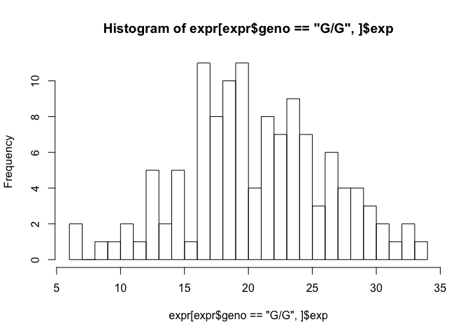
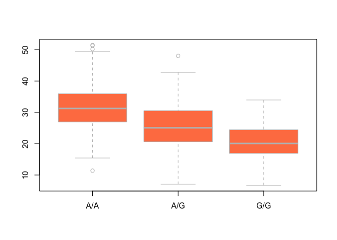

Class 14
================
Aries Chavira
2/26/2020

Preliminary analyses
--------------------

``` r
raw <- read.csv("./373531-SampleGenotypes-Homo_sapiens_Variation_Sample_rs8067378 (1).csv")

head(raw)
```

    ##   Sample..Male.Female.Unknown. Genotype..forward.strand. Population.s. Father
    ## 1                  NA19648 (F)                       A|A ALL, AMR, MXL      -
    ## 2                  NA19649 (M)                       G|G ALL, AMR, MXL      -
    ## 3                  NA19651 (F)                       A|A ALL, AMR, MXL      -
    ## 4                  NA19652 (M)                       G|G ALL, AMR, MXL      -
    ## 5                  NA19654 (F)                       G|G ALL, AMR, MXL      -
    ## 6                  NA19655 (M)                       A|G ALL, AMR, MXL      -
    ##   Mother
    ## 1      -
    ## 2      -
    ## 3      -
    ## 4      -
    ## 5      -
    ## 6      -

``` r
table(raw$Genotype..forward.strand.)
```

    ## 
    ## A|A A|G G|A G|G 
    ##  22  21  12   9

RNA-Seq result analysis for different genotypes for this SNP
------------------------------------------------------------

``` r
expr <- read.table("./rs8067378_ENSG00000172057.6.txt")
head(expr)
```

    ##    sample geno      exp
    ## 1 HG00367  A/G 28.96038
    ## 2 NA20768  A/G 20.24449
    ## 3 HG00361  A/A 31.32628
    ## 4 HG00135  A/A 34.11169
    ## 5 NA18870  G/G 18.25141
    ## 6 NA11993  A/A 32.89721

``` r
hist( expr[ expr$geno == "G/G", ]$exp, breaks = 20)
```



``` r
x <- 1:10
x[ x > 5 ]
```

    ## [1]  6  7  8  9 10

``` r
summary( expr[ expr$geno == "A/G", ]$exp )
```

    ##    Min. 1st Qu.  Median    Mean 3rd Qu.    Max. 
    ##   7.075  20.626  25.065  25.397  30.552  48.034

Try a boxplot
-------------

``` r
boxplot(exp ~ geno, data = expr, col = "coral", border = "gray")
```



How many samples are we looking at here?

``` r
nrow(expr)
```

    ## [1] 462
