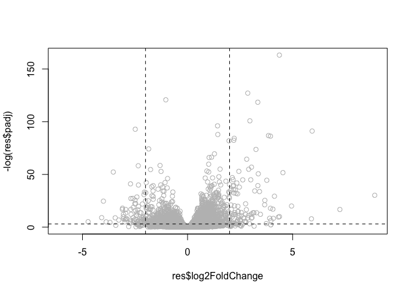

Class 15: Analysis of RNA Seq data
================

RNA Seq and transcriptomics
---------------------------

``` r
library(DESeq2)
```

    ## Loading required package: S4Vectors

    ## Loading required package: stats4

    ## Loading required package: BiocGenerics

    ## Loading required package: parallel

    ## 
    ## Attaching package: 'BiocGenerics'

    ## The following objects are masked from 'package:parallel':
    ## 
    ##     clusterApply, clusterApplyLB, clusterCall, clusterEvalQ,
    ##     clusterExport, clusterMap, parApply, parCapply, parLapply,
    ##     parLapplyLB, parRapply, parSapply, parSapplyLB

    ## The following objects are masked from 'package:stats':
    ## 
    ##     IQR, mad, sd, var, xtabs

    ## The following objects are masked from 'package:base':
    ## 
    ##     anyDuplicated, append, as.data.frame, basename, cbind, colMeans,
    ##     colnames, colSums, dirname, do.call, duplicated, eval, evalq,
    ##     Filter, Find, get, grep, grepl, intersect, is.unsorted, lapply,
    ##     lengths, Map, mapply, match, mget, order, paste, pmax, pmax.int,
    ##     pmin, pmin.int, Position, rank, rbind, Reduce, rowMeans, rownames,
    ##     rowSums, sapply, setdiff, sort, table, tapply, union, unique,
    ##     unsplit, which, which.max, which.min

    ## 
    ## Attaching package: 'S4Vectors'

    ## The following object is masked from 'package:base':
    ## 
    ##     expand.grid

    ## Loading required package: IRanges

    ## Loading required package: GenomicRanges

    ## Loading required package: GenomeInfoDb

    ## Loading required package: SummarizedExperiment

    ## Loading required package: Biobase

    ## Welcome to Bioconductor
    ## 
    ##     Vignettes contain introductory material; view with
    ##     'browseVignettes()'. To cite Bioconductor, see
    ##     'citation("Biobase")', and for packages 'citation("pkgname")'.

    ## Loading required package: DelayedArray

    ## Loading required package: matrixStats

    ## 
    ## Attaching package: 'matrixStats'

    ## The following objects are masked from 'package:Biobase':
    ## 
    ##     anyMissing, rowMedians

    ## Loading required package: BiocParallel

    ## 
    ## Attaching package: 'DelayedArray'

    ## The following objects are masked from 'package:matrixStats':
    ## 
    ##     colMaxs, colMins, colRanges, rowMaxs, rowMins, rowRanges

    ## The following objects are masked from 'package:base':
    ## 
    ##     aperm, apply

``` r
counts <- read.csv("airway_scaledcounts.csv", stringsAsFactors = FALSE)
metadata <-  read.csv("airway_metadata.csv", stringsAsFactors = FALSE)
```

``` r
nrow(counts)
```

    ## [1] 38694

``` r
ncol(counts)
```

    ## [1] 9

Averages of gene expression for each row and add it to the end of the `counts` data, and compare Control vs Treated
-------------------------------------------------------------------------------------------------------------------

Extracting the sample names of the samples that are control, from the metadata

``` r
control <- metadata[metadata$dex == "control", ]
control
```

    ##           id     dex celltype     geo_id
    ## 1 SRR1039508 control   N61311 GSM1275862
    ## 3 SRR1039512 control  N052611 GSM1275866
    ## 5 SRR1039516 control  N080611 GSM1275870
    ## 7 SRR1039520 control  N061011 GSM1275874

Finding the mean values for each gene (i.e. each row)

``` r
control.mean <- rowSums(counts[ , control$id])/ nrow(control)
names(control.mean) <- counts$ensgene
```

Treated
-------

``` r
treated <- metadata[metadata$dex =="treated", ]
treated.mean <- rowMeans(counts[,treated$id])
```

``` r
treatedavg <- rowSums(counts[ , treated$id] / nrow(treated$id))
```

``` r
mycounts <- data.frame(control.mean, treated.mean)
```

``` r
plot(mycounts)
```


Because plot is so scewed to the left, we will log it to increase visibility

``` r
plot(mycounts, log ="xy")
```

    ## Warning in xy.coords(x, y, xlabel, ylabel, log): 15032 x values <= 0 omitted
    ## from logarithmic plot

    ## Warning in xy.coords(x, y, xlabel, ylabel, log): 15281 y values <= 0 omitted
    ## from logarithmic plot


removing our values of zero in counts gr

``` r
to.rm <- unique(which(mycounts == 0, arr.ind = TRUE)[,"row"] )
newcounts <- mycounts[-to.rm, ]
nrow(newcounts)
```

    ## [1] 21817

calculate the log2 fold change of treated over controlled

``` r
newcounts$log2fc <- log2(newcounts[,"treated.mean"]/newcounts[,"control.mean"])

sum(newcounts$log2fc > 2)
```

    ## [1] 250

``` r
sum(newcounts$log2fc < -2)
```

    ## [1] 367

setup the object required from `DESeq2`

``` r
dds <- DESeqDataSetFromMatrix(countData=counts,
                              colData=metadata,
                              design=~dex,
                              tidy=TRUE)
```

    ## converting counts to integer mode

    ## Warning in DESeqDataSet(se, design = design, ignoreRank): some variables in
    ## design formula are characters, converting to factors

``` r
dds
```

    ## class: DESeqDataSet 
    ## dim: 38694 8 
    ## metadata(1): version
    ## assays(1): counts
    ## rownames(38694): ENSG00000000003 ENSG00000000005 ... ENSG00000283120
    ##   ENSG00000283123
    ## rowData names(0):
    ## colnames(8): SRR1039508 SRR1039509 ... SRR1039520 SRR1039521
    ## colData names(4): id dex celltype geo_id

``` r
dds <- DESeq(dds)
```

    ## estimating size factors

    ## estimating dispersions

    ## gene-wise dispersion estimates

    ## mean-dispersion relationship

    ## final dispersion estimates

    ## fitting model and testing

``` r
res <- results(dds)
res
```

    ## log2 fold change (MLE): dex treated vs control 
    ## Wald test p-value: dex treated vs control 
    ## DataFrame with 38694 rows and 6 columns
    ##                          baseMean     log2FoldChange             lfcSE
    ##                         <numeric>          <numeric>         <numeric>
    ## ENSG00000000003  747.194195359907  -0.35070302068658 0.168245681332529
    ## ENSG00000000005                 0                 NA                NA
    ## ENSG00000000419  520.134160051965  0.206107766417862 0.101059218008052
    ## ENSG00000000457  322.664843927049 0.0245269479387466 0.145145067649248
    ## ENSG00000000460   87.682625164828  -0.14714204922212 0.257007253994673
    ## ...                           ...                ...               ...
    ## ENSG00000283115                 0                 NA                NA
    ## ENSG00000283116                 0                 NA                NA
    ## ENSG00000283119                 0                 NA                NA
    ## ENSG00000283120 0.974916032393564  -0.66825846051647  1.69456285241871
    ## ENSG00000283123                 0                 NA                NA
    ##                               stat             pvalue              padj
    ##                          <numeric>          <numeric>         <numeric>
    ## ENSG00000000003  -2.08446967499531 0.0371174658432818 0.163034808641677
    ## ENSG00000000005                 NA                 NA                NA
    ## ENSG00000000419   2.03947517584631 0.0414026263001157 0.176031664879167
    ## ENSG00000000457  0.168982303952742  0.865810560623564 0.961694238404392
    ## ENSG00000000460  -0.57252099672319  0.566969065257939 0.815848587637731
    ## ...                            ...                ...               ...
    ## ENSG00000283115                 NA                 NA                NA
    ## ENSG00000283116                 NA                 NA                NA
    ## ENSG00000283119                 NA                 NA                NA
    ## ENSG00000283120 -0.394354484734893  0.693319342566817                NA
    ## ENSG00000283123                 NA                 NA                NA

Volcano plots
-------------

Plot of log2fc vs p-value

``` r
plot(res$log2FoldChange, -log(res$padj), col="gray")
abline(v=c(-2, +2), lty=2)
abline(h=-log(0.05), lty=2)
```


