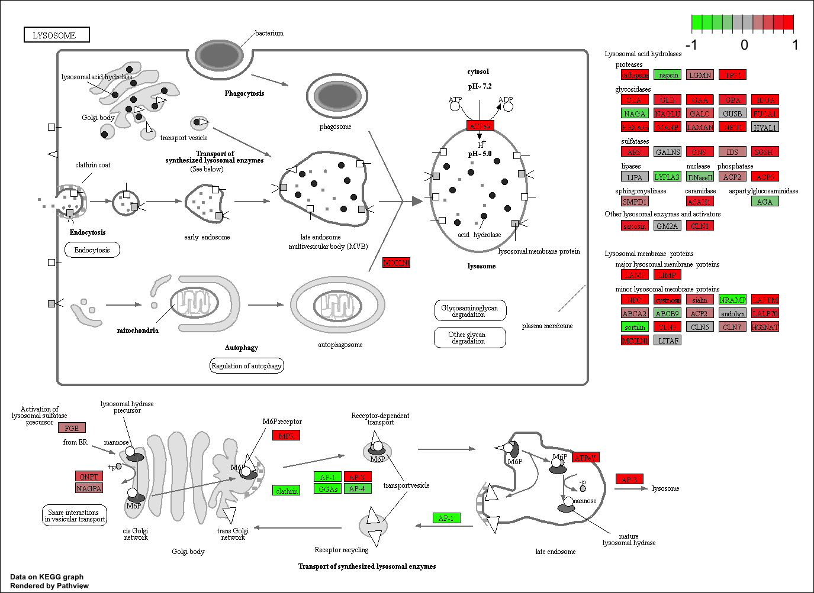
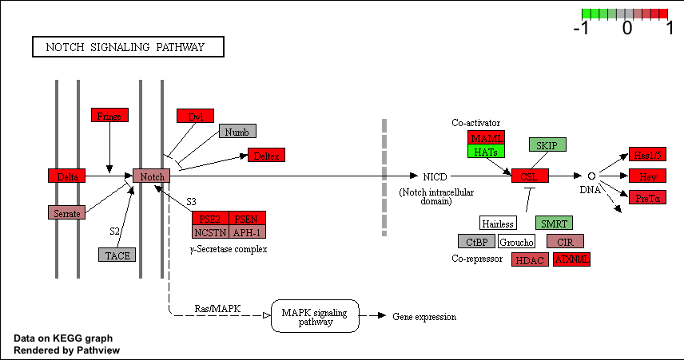
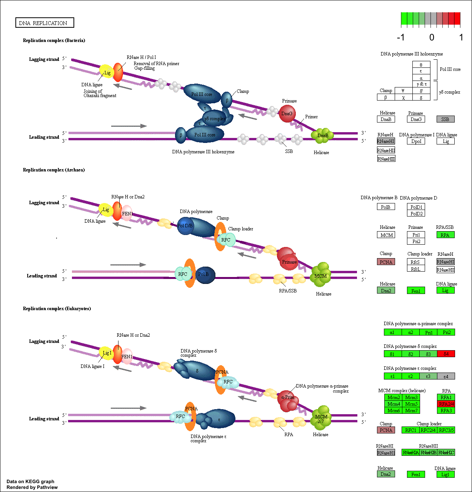
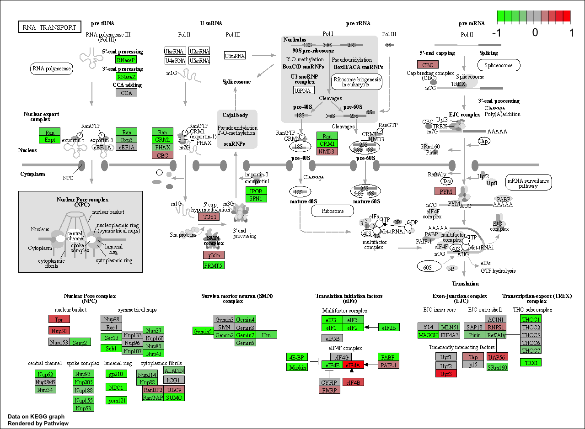
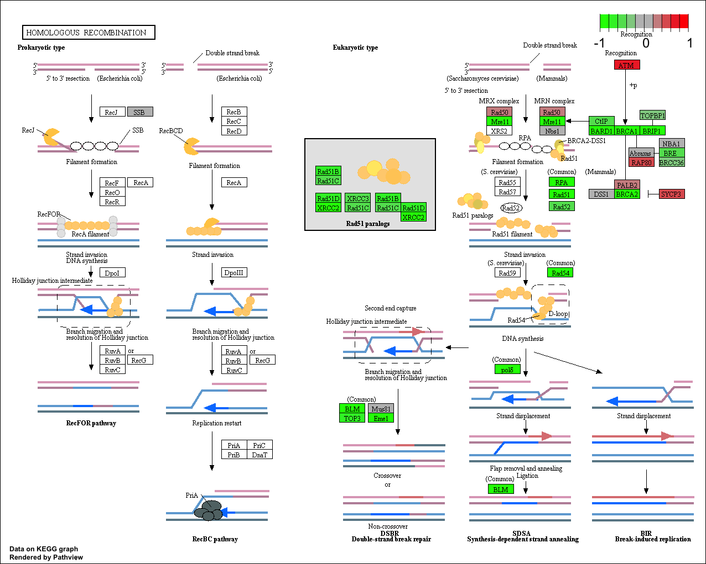
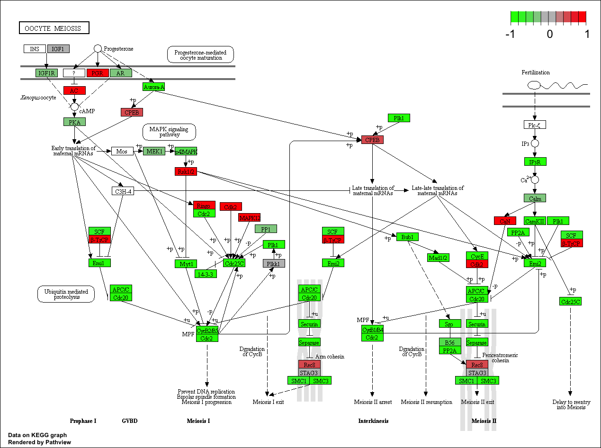

```{r setup, include=FALSE}
knitr::opts_chunk$set(echo = TRUE)
```

```{r}
library(DESeq2)
```

## Download and read input data

The data for hands-on session comes from GEO entry: GSE37704, which is associated with the following publication:

Trapnell C, Hendrickson DG, Sauvageau M, Goff L et al. "Differential analysis of gene regulation at transcript resolution with RNA-seq". Nat Biotechnol 2013 Jan;31(1):46-53. PMID: 23222703
The authors report on differential analysis of lung fibroblasts in response to loss of the developmental transcription factor HOXA1.

```{r}
# Import metadata and take a peak

colData = read.csv("GSE37704_metadata.csv", row.names=1)
head(colData)
```

```{r}
countData <- read.csv("./GSE37704_featurecounts.csv", row.names = 1)
head(countData)
```

```{r}
countData <- countData[ , -1]

head(countData)
```


```{r}
ncol(countData)
```

## Remove genes that have zero hits in the counts column for all 
```{r}
inds <- rowSums(countData) != 0
countData2 <- countData[ inds, ]
```

```{r}
dim(countData2)
```

How many genes did we get rid of that had no data? How many do we have left?

```{r}
library(DESeq2)
```

```{r}
dds = DESeqDataSetFromMatrix(countData=countData2,
                             colData=colData,
                             design=~condition)
dds = DESeq(dds)
```

```{r}
res <- results(dds)
head(res)

plot(res$log2FoldChange, -log(res$padj))

# Make a color vector for all genes
mycols <- rep("gray", nrow(res) )

# Color red the genes with absolute fold change above 2
mycols[ abs(res$log2FoldChange) > 2 ] <- "red"

# Color blue those with adjusted p-value less than 0.01
#  and absolute fold change more than 2
inds <- ( 0.01) & (abs(res$log2FoldChange) > 2 )
mycols[ inds ] <- "blue"

plot( res$log2FoldChange, -log(res$padj), col= "darkred", xlab="Log2(FoldChange)", ylab="-Log(P-value)" )
```

Add more color

```{r}

mycols <- rep("gray", nrow(res) )
mycols[ abs(res$log2FoldChange) > 2] <- "blue"
plot(res$log2FoldChange, -log(res$padj), col=mycols)

```

```{r}
#write(res)
```

```{r}
# BiocManager::install("AnnotationDbi")
# BiocManager::install("org.Hs.eg.db")
```

lets map our ENSEBLE gene ids to a more conventional gene symbol 


```{r}
library(AnnotationDbi)
library(org.Hs.eg.db)
columns(org.Hs.eg.db)
```

```{r}
columns(org.Hs.eg.db)
res$symbol = mapIds(org.Hs.eg.db,
                    keys= row.names(res), 
                    keytype="ENSEMBL",
                    column="SYMBOL",
                    multiVals="first")

res$entrez = mapIds(org.Hs.eg.db,
                    keys= row.names(res),
                    keytype="ENSEMBL",
                    column="ENTREZID",
                    multiVals="first")

res$name =   mapIds(org.Hs.eg.db,
                    keys=row.names(res),
                    keytype= "ENSEMBL",
                    column="GENENAME",
                    multiVals="first")
head(res)
```

```{r}
write.csv(res, file = "./res.csv")
```

Load librarys 
```{r}
library(gage)
library(gageData)

data(kegg.sets.hs)
data(sigmet.idx.hs)
```

```{r}
# Focus on signaling and metabolic pathways only
kegg.sets.hs = kegg.sets.hs[sigmet.idx.hs]

# Examine the first 3 pathways
head(kegg.sets.hs, 3)
```


```{r}
foldchanges = res$log2FoldChange
names(foldchanges) = res$entrez
head(foldchanges)
```
```{r}
foldchanges
```

```{r}
# Get the results
keggres = gage(foldchanges, gsets=kegg.sets.hs)

attributes(keggres)
```
```{r}
keggres$less
```
```{r}
library(pathview)
```

```{r}
pathview(gene.data=foldchanges, pathway.id="hsa04110")

# A different PDF based output of the same data
pathview(gene.data=foldchanges, pathway.id="hsa04110", kegg.native=FALSE)
```

```{r}
## Focus on top 5 upregulated pathways here for demo purposes only
keggrespathways <- rownames(keggres$greater)[1:5]

# Extract the 8 character long IDs part of each string
keggresids = substr(keggrespathways, start=1, stop=8)
keggresids
```

```{r}
pathview(gene.data=foldchanges, pathway.id=keggresids, species="hsa")
```
```{r}
knitr::include_graphics("hsa04110.pathview.png")
knitr::include_graphics("hsa04640.pathview.png")
knitr::include_graphics("hsa04630.pathview.png")


```

Downregulated 5?

```{r}
## Focus on top 5 downregulated pathways here for demo purposes only
keggresdownregulated <- rownames(keggres$less)[1:5]

# Extract the 8 character long IDs part of each string
keggresids_downreg = substr(keggresdownregulated, start=1, stop=8)
keggresids_downreg
```

```{r}
pathview(gene.data=foldchanges, pathway.id=keggresids_downreg, species="hsa")
```

```{r}
knitr::include_graphics("hsa04110.pathview.png")




```

Try for high resolution figure

```{r}
pathview(gene.data=foldchanges, pathway.id="hsa04110", kegg.native=FALSE)
```

```{r}
sig_genes <- res[res$padj <= 0.05 & !is.na(res$padj), "symbol"]
print(paste("Total number of significant genes:", length(sig_genes)))
```


