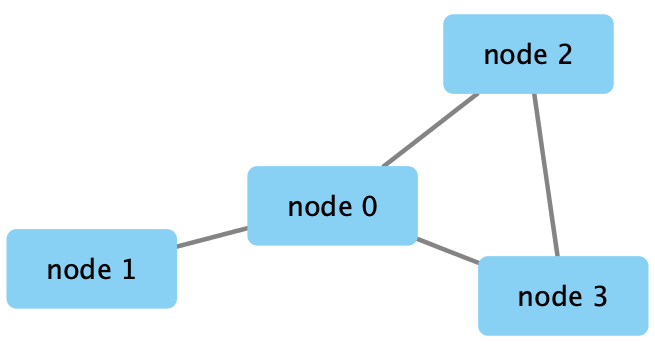
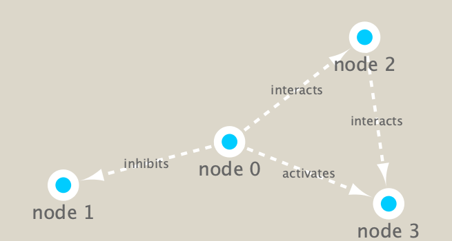

```{r setup, include=FALSE}
knitr::opts_chunk$set(echo = TRUE)
```

# TARA oceans analysis
```{r}
library(RCy3)
library(igraph)
library(RColorBrewer)
```

## Set up R package we need 
```{r}
# Test the connection to Cytoscape.
cytoscapePing()
```

```{r}
g <- makeSimpleIgraph()
createNetworkFromIgraph(g,"myGraph")

fig <- exportImage(filename="demo", type="png", height=350)
```

```{r}

```
```{r}
setVisualStyle("Marquee")

fig <- exportImage(filename="demo_marquee", type="png", height=350)


```

```{r}
styles <- getVisualStyleNames()
styles
```

```{r}
plot(g)
```

```{r}
## scripts for processing located in "inst/data-raw/"
prok_vir_cor <- read.delim("./virus_prok_cor_abundant.tsv", stringsAsFactors = FALSE)

## Have a peak at the first 6 rows
head(prok_vir_cor)
```

```{r}
g <- graph.data.frame(prok_vir_cor, directed = FALSE)
g
```

```{r}
plot(g)
```

```{r}
plot(g, vertex.label=NA)
```


```{r}
# The nodes/vertex are too big. Lets make them smaller…

plot(g, vertex.size=3, vertex.label=NA)
```
```{r}
library(ggraph)
```

```{r}
ggraph(g, layout = 'auto') +
  geom_edge_link(alpha = 0.25) +
  geom_node_point(color="steelblue") +
  theme_graph()
```

```{r}
createNetworkFromIgraph(g,"myIgraph")
```


```{r}
# Network querys
# Note that we can query (and set) vertex and edge attributes with the V() and E() functions    # respectively:

V(g)
```

```{r}
V(g)
E(g)
```

```{r}
cb <- cluster_edge_betweenness(g)
```
```{r}
plot(cb, y=g, vertex.label=NA,  vertex.size=3)
```


