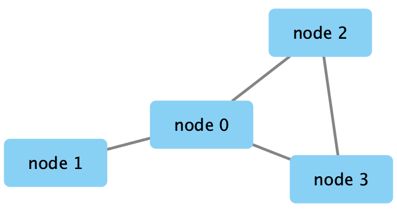
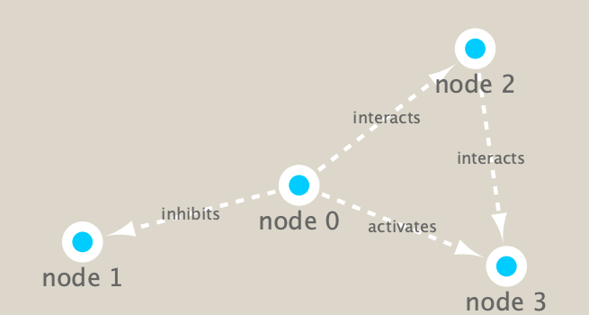
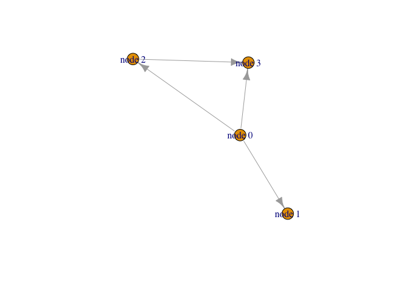
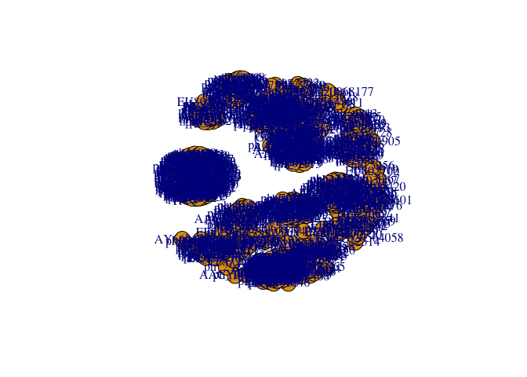
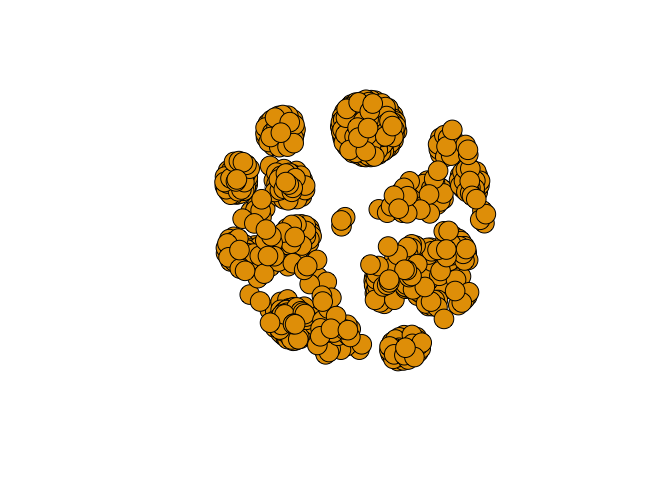
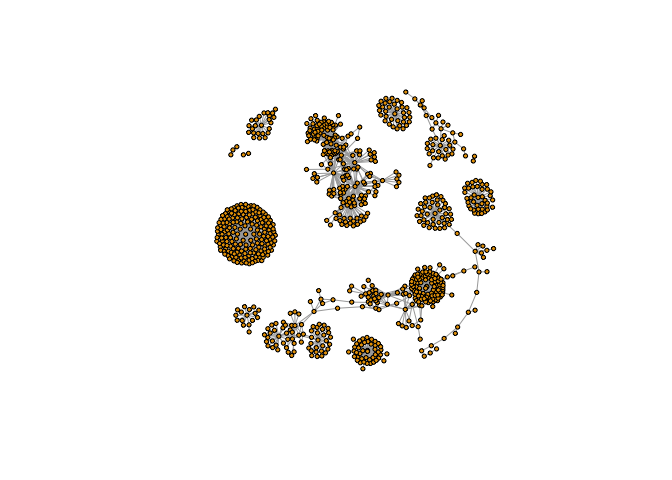
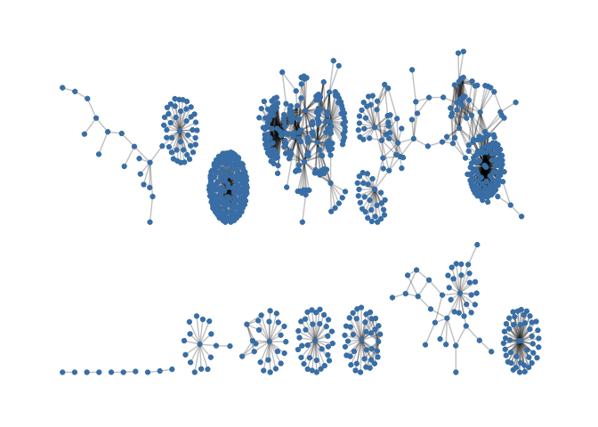
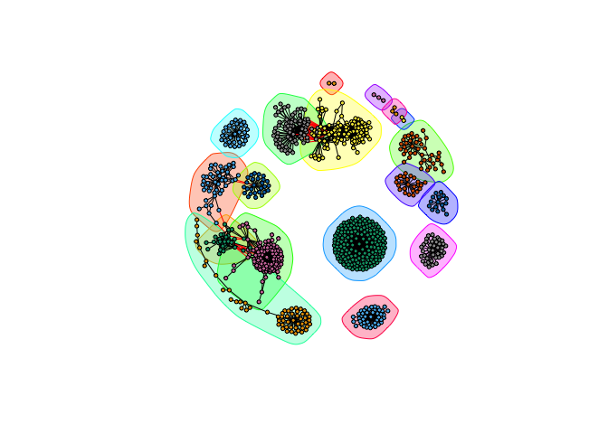

Class17\_B
================
Aries Chavira
3/4/2020

TARA oceans analysis
====================

``` r
library(RCy3)
library(igraph)
```

    ## 
    ## Attaching package: 'igraph'

    ## The following objects are masked from 'package:stats':
    ## 
    ##     decompose, spectrum

    ## The following object is masked from 'package:base':
    ## 
    ##     union

``` r
library(RColorBrewer)
```

Set up R package we need
------------------------

``` r
# Test the connection to Cytoscape.
cytoscapePing()
```

    ## [1] "You are connected to Cytoscape!"

``` r
g <- makeSimpleIgraph()
createNetworkFromIgraph(g,"myGraph")
```

    ## Loading data...
    ## Applying default style...
    ## Applying preferred layout...

    ## networkSUID 
    ##          52

``` r
fig <- exportImage(filename="demo", type="png", height=350)
```

``` r

```


``` r
setVisualStyle("Marquee")
```

    ##                 message 
    ## "Visual Style applied."

``` r
fig <- exportImage(filename="demo_marquee", type="png", height=350)


```


``` r
styles <- getVisualStyleNames()
styles
```

    ##  [1] "Minimal"              "default black"        "BioPAX"              
    ##  [4] "Big Labels"           "Gradient1"            "Sample3"             
    ##  [7] "Ripple"               "Directed"             "Marquee"             
    ## [10] "size_rank"            "Universe"             "Sample1"             
    ## [13] "default"              "Nested Network Style" "Curved"              
    ## [16] "Solid"                "Sample2"              "BioPAX_SIF"

``` r
plot(g)
```



``` r
## scripts for processing located in "inst/data-raw/"
prok_vir_cor <- read.delim("./virus_prok_cor_abundant.tsv", stringsAsFactors = FALSE)

## Have a peak at the first 6 rows
head(prok_vir_cor)
```

    ##       Var1          Var2    weight
    ## 1  ph_1061 AACY020068177 0.8555342
    ## 2  ph_1258 AACY020207233 0.8055750
    ## 3  ph_3164 AACY020207233 0.8122517
    ## 4  ph_1033 AACY020255495 0.8487498
    ## 5 ph_10996 AACY020255495 0.8734617
    ## 6 ph_11038 AACY020255495 0.8740782

``` r
g <- graph.data.frame(prok_vir_cor, directed = FALSE)
g
```

    ## IGRAPH a0b4363 UNW- 845 1544 -- 
    ## + attr: name (v/c), weight (e/n)
    ## + edges from a0b4363 (vertex names):
    ##  [1] ph_1061 --AACY020068177 ph_1258 --AACY020207233 ph_3164 --AACY020207233
    ##  [4] ph_1033 --AACY020255495 ph_10996--AACY020255495 ph_11038--AACY020255495
    ##  [7] ph_11040--AACY020255495 ph_11048--AACY020255495 ph_11096--AACY020255495
    ## [10] ph_1113 --AACY020255495 ph_1208 --AACY020255495 ph_13207--AACY020255495
    ## [13] ph_1346 --AACY020255495 ph_14679--AACY020255495 ph_1572 --AACY020255495
    ## [16] ph_16045--AACY020255495 ph_1909 --AACY020255495 ph_1918 --AACY020255495
    ## [19] ph_19894--AACY020255495 ph_2117 --AACY020255495 ph_2231 --AACY020255495
    ## [22] ph_2363 --AACY020255495 ph_276  --AACY020255495 ph_2775 --AACY020255495
    ## + ... omitted several edges

``` r
plot(g)
```



``` r
plot(g, vertex.label=NA)
```



``` r
# The nodes/vertex are too big. Lets make them smaller…

plot(g, vertex.size=3, vertex.label=NA)
```



``` r
library(ggraph)
```

    ## Loading required package: ggplot2

``` r
ggraph(g, layout = 'auto') +
  geom_edge_link(alpha = 0.25) +
  geom_node_point(color="steelblue") +
  theme_graph()
```

    ## Using `stress` as default layout



``` r
createNetworkFromIgraph(g,"myIgraph")
```

    ## Loading data...
    ## Applying default style...
    ## Applying preferred layout...

    ## networkSUID 
    ##          80

``` r
# Network querys
# Note that we can query (and set) vertex and edge attributes with the V() and E() functions    # respectively:

V(g)
```

    ## + 845/845 vertices, named, from a0b4363:
    ##   [1] ph_1061       ph_1258       ph_3164       ph_1033       ph_10996     
    ##   [6] ph_11038      ph_11040      ph_11048      ph_11096      ph_1113      
    ##  [11] ph_1208       ph_13207      ph_1346       ph_14679      ph_1572      
    ##  [16] ph_16045      ph_1909       ph_1918       ph_19894      ph_2117      
    ##  [21] ph_2231       ph_2363       ph_276        ph_2775       ph_2798      
    ##  [26] ph_3217       ph_3336       ph_3493       ph_3541       ph_3892      
    ##  [31] ph_4194       ph_4602       ph_4678       ph_484        ph_4993      
    ##  [36] ph_4999       ph_5001       ph_5010       ph_5286       ph_5287      
    ##  [41] ph_5302       ph_5321       ph_5643       ph_6441       ph_654       
    ##  [46] ph_6954       ph_7389       ph_7920       ph_8039       ph_8695      
    ## + ... omitted several vertices

``` r
V(g)
```

    ## + 845/845 vertices, named, from a0b4363:
    ##   [1] ph_1061       ph_1258       ph_3164       ph_1033       ph_10996     
    ##   [6] ph_11038      ph_11040      ph_11048      ph_11096      ph_1113      
    ##  [11] ph_1208       ph_13207      ph_1346       ph_14679      ph_1572      
    ##  [16] ph_16045      ph_1909       ph_1918       ph_19894      ph_2117      
    ##  [21] ph_2231       ph_2363       ph_276        ph_2775       ph_2798      
    ##  [26] ph_3217       ph_3336       ph_3493       ph_3541       ph_3892      
    ##  [31] ph_4194       ph_4602       ph_4678       ph_484        ph_4993      
    ##  [36] ph_4999       ph_5001       ph_5010       ph_5286       ph_5287      
    ##  [41] ph_5302       ph_5321       ph_5643       ph_6441       ph_654       
    ##  [46] ph_6954       ph_7389       ph_7920       ph_8039       ph_8695      
    ## + ... omitted several vertices

``` r
E(g)
```

    ## + 1544/1544 edges from a0b4363 (vertex names):
    ##  [1] ph_1061 --AACY020068177 ph_1258 --AACY020207233 ph_3164 --AACY020207233
    ##  [4] ph_1033 --AACY020255495 ph_10996--AACY020255495 ph_11038--AACY020255495
    ##  [7] ph_11040--AACY020255495 ph_11048--AACY020255495 ph_11096--AACY020255495
    ## [10] ph_1113 --AACY020255495 ph_1208 --AACY020255495 ph_13207--AACY020255495
    ## [13] ph_1346 --AACY020255495 ph_14679--AACY020255495 ph_1572 --AACY020255495
    ## [16] ph_16045--AACY020255495 ph_1909 --AACY020255495 ph_1918 --AACY020255495
    ## [19] ph_19894--AACY020255495 ph_2117 --AACY020255495 ph_2231 --AACY020255495
    ## [22] ph_2363 --AACY020255495 ph_276  --AACY020255495 ph_2775 --AACY020255495
    ## [25] ph_2798 --AACY020255495 ph_3217 --AACY020255495 ph_3336 --AACY020255495
    ## [28] ph_3493 --AACY020255495 ph_3541 --AACY020255495 ph_3892 --AACY020255495
    ## + ... omitted several edges

``` r
cb <- cluster_edge_betweenness(g)
```

    ## Warning in cluster_edge_betweenness(g): At community.c:460 :Membership vector
    ## will be selected based on the lowest modularity score.

    ## Warning in cluster_edge_betweenness(g): At community.c:467 :Modularity
    ## calculation with weighted edge betweenness community detection might not make
    ## sense -- modularity treats edge weights as similarities while edge betwenness
    ## treats them as distances

``` r
plot(cb, y=g, vertex.label=NA,  vertex.size=3)
```


