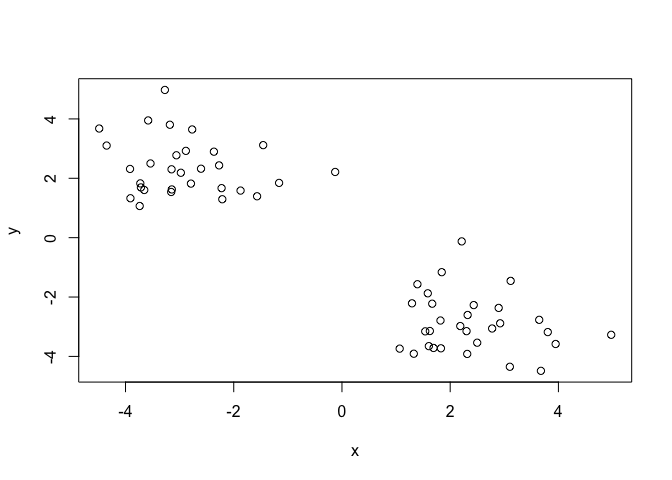

Class 9: Machine learning pt1
================
Aries Chavira
2/5/2020

K-means cluster
---------------

``` r
tmp <- c(rnorm(30,-3), rnorm(30,3))
x <- cbind(x=tmp, y=rev(tmp))

plot(x)
```



``` r
km <- kmeans(x, centers= 2, nstart= 20)

print(km)
```

    ## K-means clustering with 2 clusters of sizes 30, 30
    ## 
    ## Cluster means:
    ##           x         y
    ## 1 -2.895376  2.380909
    ## 2  2.380909 -2.895376
    ## 
    ## Clustering vector:
    ##  [1] 1 1 1 1 1 1 1 1 1 1 1 1 1 1 1 1 1 1 1 1 1 1 1 1 1 1 1 1 1 1 2 2 2 2 2 2 2 2
    ## [39] 2 2 2 2 2 2 2 2 2 2 2 2 2 2 2 2 2 2 2 2 2 2
    ## 
    ## Within cluster sum of squares by cluster:
    ## [1] 53.70963 53.70963
    ##  (between_SS / total_SS =  88.6 %)
    ## 
    ## Available components:
    ## 
    ## [1] "cluster"      "centers"      "totss"        "withinss"     "tot.withinss"
    ## [6] "betweenss"    "size"         "iter"         "ifault"

What is in the output object `km` I can use the `attributes()` function

``` r
attributes(km)
```

    ## $names
    ## [1] "cluster"      "centers"      "totss"        "withinss"     "tot.withinss"
    ## [6] "betweenss"    "size"         "iter"         "ifault"      
    ## 
    ## $class
    ## [1] "kmeans"

Q. How many points are in the each cluster?

``` r
km$size
```

    ## [1] 30 30

Q. What 'component' of your result object details cluster assignment and cluster centers as blue points

``` r
km$cluster
```

    ##  [1] 1 1 1 1 1 1 1 1 1 1 1 1 1 1 1 1 1 1 1 1 1 1 1 1 1 1 1 1 1 1 2 2 2 2 2 2 2 2
    ## [39] 2 2 2 2 2 2 2 2 2 2 2 2 2 2 2 2 2 2 2 2 2 2

Q. You can check many 2s and 1s are in this vector with the `table()` function

``` r
table(km$cluster)
```

    ## 
    ##  1  2 
    ## 30 30

``` r
plot(x, col=km$cluster)
points(km$centers, col="blue", pch=8, cex=4)
```


Hierarchical Clustering with `hclust()`
---------------------------------------

There are two different types of clustering: `hclust` -Bottom up -Top down

You need to tell is the distance to which it will consider two things in a cluster, often determined by Euclidean distance. Below is an example of using `dist()` to create the distance matix;

``` r
hc <- hclust(dist(x))

plot(hc)

abline(h=6, col="red")
```


``` r
# Cut by height h
# Calling k tells cutree() to cut the tree to generate k number of clusters 
table( cutree(hc, k=5))
```

    ## 
    ##  1  2  3  4  5 
    ##  6 24 22  2  6

Q. Use the dist(), hclust(), plot() and cutree() functions to return 2 and 3 clusters Q. How does this compare to your known 'col' groups?

``` r
x <- rbind(
 matrix(rnorm(100, mean=0, sd=0.3), ncol = 2), # c1
 matrix(rnorm(100, mean=1, sd=0.3), ncol = 2), # c2
 matrix(c(rnorm(50, mean=1, sd=0.3), # c3
 rnorm(50, mean=0, sd=0.3)), ncol = 2))
colnames(x) <- c("x", "y")

plot(x)
```


``` r
col <- as.factor( rep(c("c1","c2","c3"), each=50) )
plot(x, col=col)
```


``` r
plot(hc)

plot(hc)
```

 \#\# Using European data to generate PCA's

The main function in base R for PCA is called `prcomp()`. Here we will use PCA's to examine the funny food that folks eat in the UK and N.Ireland.

``` r
x <- read.csv("./UK_foods.csv", row.names = 1)
# dim() function returns the number of rows and columns or the nrow() and ncol() functions to return each separately,
dim(x)
```

    ## [1] 17  4

Make some conventional plots

``` r
#PCA to the rescue! 
pca <- prcomp( t(x) )

summary(pca)
```

    ## Importance of components:
    ##                             PC1      PC2      PC3       PC4
    ## Standard deviation     324.1502 212.7478 73.87622 4.189e-14
    ## Proportion of Variance   0.6744   0.2905  0.03503 0.000e+00
    ## Cumulative Proportion    0.6744   0.9650  1.00000 1.000e+00

``` r
attributes(pca)
```

    ## $names
    ## [1] "sdev"     "rotation" "center"   "scale"    "x"       
    ## 
    ## $class
    ## [1] "prcomp"

``` r
plot(pca$x[,1], pca$x[,2])
text(pca$x[,1], pca$x[,2], labels = colnames(x),
  col=c("black","red","blue","coral"))
```


