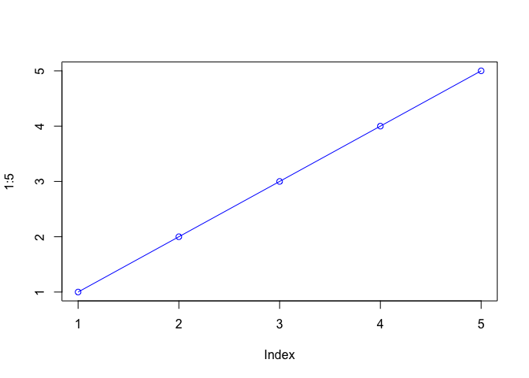
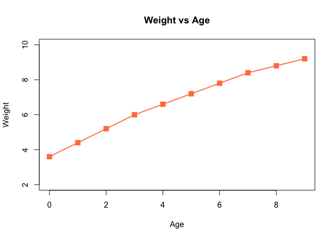
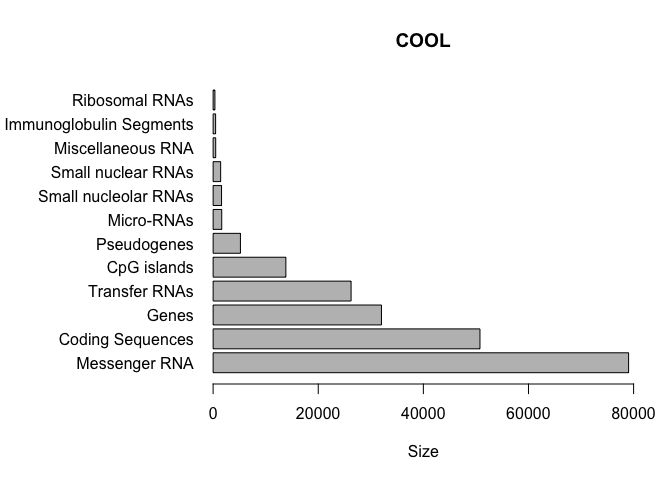

Class 5: Data visualization and graphics in R
================

Class 5 : Data Visualization
============================

``` r
plot(1:5, col="blue", typ="o")
```



``` r
weight <- read.table("./bimm143_05_rstats/weight_chart.txt", header=TRUE)

weight
```

    ##    Age Weight
    ## 1    0    3.6
    ## 2    1    4.4
    ## 3    2    5.2
    ## 4    3    6.0
    ## 5    4    6.6
    ## 6    5    7.2
    ## 7    6    7.8
    ## 8    7    8.4
    ## 9    8    8.8
    ## 10   9    9.2

``` r
plot(weight$Age, weight$Weight, type = "o", pch=15, cex=1.5, lwd=2, ylim=c(2,10), xlab = "Age", ylab = "Weight", main = "Weight vs Age", col="coral")
```



``` r
mouse <- read.delim("./bimm143_05_rstats/feature_counts.txt", header=TRUE)

par(mar=c(5, 11.1, 4.1, 2))
barplot(mouse$Count, horiz=TRUE, ylab="", 
        names.arg = mouse$Feature, 
        main="COOL", las=1, xlim=c(0,80000), xlab="Size")
```


