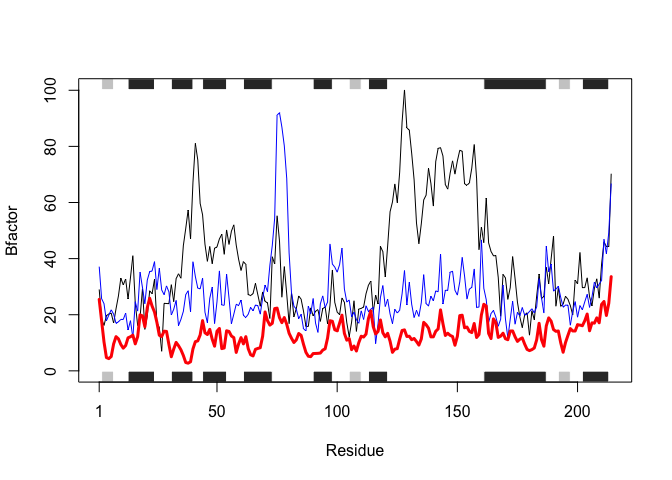

Class 6: Writing your own R functions
================
Aries Chavira
1/24/2020

Lesson 1
========

1.  lets insert a code chunk with the shortcut `option-CMD-i`:

2.  read.table(file, header = TRUE, sep = "") == read.delim This is beacuse **read.table()** is the parent funciton of
    -   read.csv
    -   read.csv2
    -   read.delim

Saving Files
------------

Table one

``` r
x <- read.table("test1.txt", sep = ",", header = TRUE)
x
```

    ##   Col1 Col2 Col3
    ## 1    1    2    3
    ## 2    4    5    6
    ## 3    7    8    9
    ## 4    a    b    c

Table two

``` r
x <- read.table("test2.txt", sep = "$", header = TRUE)
x
```

    ##   Col1 Col2 Col3
    ## 1    1    2    3
    ## 2    4    5    6
    ## 3    7    8    9
    ## 4    a    b    c

Table three

``` r
x <- read.table("test3.txt")
x
```

    ##   V1 V2 V3
    ## 1  1  6  a
    ## 2  2  7  b
    ## 3  3  8  c
    ## 4  4  9  d
    ## 5  5 10  e

Lesson two
----------

Creating Functions
==================

This is an example of a function named `add` with input `x` and `y`.

``` r
add <- function(x, y=1) {
  # Sum the inputs x, and y
  x + y
}
```

Try using it!

Example 1:

``` r
add(x=c(1,6,2), y=4)
```

    ## [1]  5 10  6

Example 2:

``` r
x <- c(10,4,22,6)
min(x)
```

    ## [1] 4

``` r
max(x)
```

    ## [1] 22

``` r
range(x)
```

    ## [1]  4 22

Example 3:

``` r
rescale <- function(x) {
  rng <- range(x, na.rm = TRUE)
  (x - rng[1]) / (rng[2] - rng)
}
```

``` r
x <- c(10,4,5,3,12,NA)
rescale(x) 
```

    ## [1] 0.7777778       Inf 0.2222222       NaN 1.0000000        NA

Rescale 3

``` r
rescale3 <- function(x, na.rm=TRUE, plot=FALSE) {

    rng <-range(x, na.rm=na.rm)
    print("Hello")
 
    answer <- (x - rng[1]) / (rng[2] - rng[1])
    
    if(plot) {
      plot(answer, typ="b", lwd=4)
    }
  print("is it me you are looking for?")
  print("I can see it in ...")
}

rescale3(x)
```

    ## [1] "Hello"
    ## [1] "is it me you are looking for?"
    ## [1] "I can see it in ..."

Working with bio3d package
--------------------------

To use funcitons for any package type `library()` to load it.

``` r
library("bio3d")
s1 <- read.pdb("4AKE") # kinase with drug
```

    ##   Note: Accessing on-line PDB file

``` r
s2 <- read.pdb("1AKE") # kinase no drug
```

    ##   Note: Accessing on-line PDB file
    ##    PDB has ALT records, taking A only, rm.alt=TRUE

``` r
s3 <- read.pdb("1E4Y") # kinase with drug
```

    ##   Note: Accessing on-line PDB file

``` r
s1.chainA <- trim.pdb(s1, chain="A", elety="CA")
s2.chainA <- trim.pdb(s2, chain="A", elety="CA")
s3.chainA <- trim.pdb(s3, chain="A", elety="CA")

s1.b <- s1.chainA$atom$b
s2.b <- s2.chainA$atom$b
s3.b <- s3.chainA$atom$b

plotb3(s1.b, sse=s1.chainA, typ="l", ylab="Bfactor")
```


``` r
plotb3(s2.b, sse=s2.chainA, typ="l", ylab="Bfactor")
```


``` r
plotb3(s3.b, sse=s3.chainA, typ="l", ylab="Bfactor")
```


what is read.pdb?

``` r
s1 <- read.pdb("4AKE") # kinase with drug
```

    ##   Note: Accessing on-line PDB file

    ## Warning in get.pdb(file, path = tempdir(), verbose = FALSE): /var/folders/
    ## st/002yhgd16h9bk28t1thty_jm0000gn/T//Rtmpv7qFGJ/4AKE.pdb exists. Skipping
    ## download

``` r
s1
```

    ## 
    ##  Call:  read.pdb(file = "4AKE")
    ## 
    ##    Total Models#: 1
    ##      Total Atoms#: 3459,  XYZs#: 10377  Chains#: 2  (values: A B)
    ## 
    ##      Protein Atoms#: 3312  (residues/Calpha atoms#: 428)
    ##      Nucleic acid Atoms#: 0  (residues/phosphate atoms#: 0)
    ## 
    ##      Non-protein/nucleic Atoms#: 147  (residues: 147)
    ##      Non-protein/nucleic resid values: [ HOH (147) ]
    ## 
    ##    Protein sequence:
    ##       MRIILLGAPGAGKGTQAQFIMEKYGIPQISTGDMLRAAVKSGSELGKQAKDIMDAGKLVT
    ##       DELVIALVKERIAQEDCRNGFLLDGFPRTIPQADAMKEAGINVDYVLEFDVPDELIVDRI
    ##       VGRRVHAPSGRVYHVKFNPPKVEGKDDVTGEELTTRKDDQEETVRKRLVEYHQMTAPLIG
    ##       YYSKEAEAGNTKYAKVDGTKPVAEVRADLEKILGMRIILLGAPGA...<cut>...KILG
    ## 
    ## + attr: atom, xyz, seqres, helix, sheet,
    ##         calpha, remark, call

``` r
plotb3(s1.b, sse=s1.chainA, typ="l", ylab="Bfactor")
points(s2.b, col="blue", type="l")
points(s3.b, col="red", type="l", lwd=3)
```


